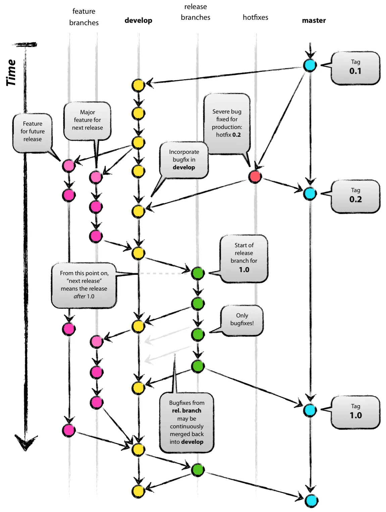

## Git에서 branch merge 방법들과 각 방법의 특징을 설명해 주세요.

💡 **여러명이 공동 작업하는** `repository`를 `clone`하여 작업을 한다고 생각해보자

`master-branch` 라는 **공동의 브랜치**가 존재하고, 나는 `new-branch`를 **생성**하여 코드 작업을 한다.

❗ 작업을 모두 마치고, `master-branch`에 `merge`를 하려고 하는데, 내가 `merge`하기 전에 누군가 `master-branch` 에 다른 작업을 한 뒤 `commit`하고 `push`를 했다고 하자. 

그럼 이런 모양이 될 것이다.

이 경우에 내 `new-branch`를 `master-branch`에 `merge`하는 방법에는 몇 가지 방법이 있다.

### 1️⃣ Merge Commit

`'Merge commit'` 방식은 **두 브랜치의 변경 사항을 모두 유지**하면서 `merge`한다. 

이 방식을 사용하면, 각 브랜치의 변경 사항이 과거의 커밋으로 보존되고, **새로운 커밋이 추가**되어 최종 병합이 완료된다. 

⬆️ 위 예시에서는 **새로운 커밋** `m`이 추가되어 병합이 된 것을 확인할 수 있다.

---

**👍 장점**

- 각 `branch`의 **히스토리를 모두 유지**하면서, 변경 사항을 병합할 수 있다.

**👎 단점**

- 커밋 히스토리가 복잡해질 수 있다.

---

### 2️⃣ Squash and merge

`'Squash and Merge'`는 브랜치에서의 **모든 변경 사항을 하나의 커밋으로 압축**하여 병합하는 방식.

이 방식은 **각각의 커밋에서 발생한 모든 변경 사항을 병합 후에 하나의 새로운 커밋을 생성**한다. 

⬆️ 위 예시에서는 **세 개의 커밋**  `a-b-c` **가**  **하나의 커밋**  `abc` **로** **합쳐져서 병합**이 된 것을 확인할 수 있다.

---

**👍 장점**

- 커밋 히스토리를 간단하게 유지할 수 있다.
- 여러 커밋들이 하나의 커밋으로 합쳐지는 것이므로, 커밋 하나하나가 완성된 기능을 의미하게 만들 수 있다.
- 커밋들을 합칠 때, PR에서 발생한 자잘한 문제들을 숨기고, 그 PR에서 가장 중요하고 필요했던 내용들만 압축하여 담을 수 있다.

**👎 단점**

- 작업의 상세한 이력을 잃게 된다.
- 합치기 전의 각 커밋에 대한 개별적인 맥락 등을 알 수 없기 때문에 추후에 문제 해결이 어려울 수 있다.
- 기존의 커밋 아이디들이 하나로 합쳐지면서 사라져버린다. 이로 인해 복잡한 문제가 야기될 수 있다.

---

### 3️⃣ Rebase and merge

`'Rebase and Merge'`는 **현재 branch를 target branch에 재위치(rebase)**시킨 후 병합하는 방식. 

이는 **target branch의 커밋 위로** **현재 branch의** **모든 커밋을 옮겨 놓는 것**과 같다. 이렇게 되면 커밋 히스토리는 선형적으로 유지된다.

⬆️ 위 예시에서는 **new-branch의 모든 커밋을 master-branch 의 커밋 위로 옮겨서 병합이 된것을 확인할 수 있다.**

---

**👍 장점**

- 깨끗하고 선형적인 커밋 히스토리를 만들 수 있다.
- 히스토리 파악 및 코드의 변화 이해가 더욱 쉬워질 수 있다.

**👎 단점**

- 관련된 커밋의 ID들이 모두 바뀌게 되어 혼란을 초래할 수 있다.

---

### + 🍒 **Cherry-Pick**

위 상황에서,  `커밋 a` 와 `커밋 c`만 master-branch에 **추가**하고 싶다고 하자.

이 때, `‘Cherry-Pick’` 방식을 사용하면 해당 커밋들 아래처럼 추가된다.

이렇게, 원하는 커밋만 추가하고 싶을 때 `‘Cherry-Pick’` 을 사용한다.

---

만약, 겹치는 내용이 있어서 conflict가 발생한다면, 우리가 할 수 있는 두 가지 옵션이 있다.

**1️⃣ Conflict를 해결하고 cherry-pick을 진행시킨다.**

1. Conflict을 해결하기 위해 **코드를 수정**한다.
2. **`git add <path>`** 명령어로 수정된 코드를 올린다. (커밋은 다시 할 필요 없다.)
3. **`git cherry-pick –continue`** 명령어를 사용하면 다시 진행이 시작된다.

**2️⃣ cherry-pick을 중단한다.**

- **`git cherry-pick –abort`** 명령어를 사용해 `cherry-pick`을 중단하면, `cherry-pick`을 **하기 전 상태**로 돌아 갈 수 있다.
  

## Git Flow 브랜치 전략에 대해 설명해 주세요.

### Git Flow

Git을 사용한 **브랜치 전략** 중 하나로, **기능 개발**, **버그 수정**, **배포 등**의 **작업을 명확하게 구분**하고 **협업을 체계적으로** 할 수 있도록 설계된 워크플로우이다. 

대규모 프로젝트나 팀 협업에서 특히 유용하다!

`Git Flow`의 핵심 개념은 **브랜치 역할의 명확한 분리.**

각 브랜치가 **고유한 목적과 역할**을 가지며, 이를 통해 안정성과 개발 속도를 유지할 수 있다. 

---

`Git Flow`에서는 아래 총 **5가지 주요 브랜치**를 사용한다.

- `master` : 제품으로 출시될 수 있는 브랜치
- `develop` : 다음 출시 버전을 개발하는 브랜치
- `feature` : 기능을 개발하는 브랜치
- `release` : 이번 출시 버전을 준비하는 브랜치
- `hotfix` : 출시 버전에서 발생한 버그를 수정 하는 브랜치

---

- `main`에서 `develop` 브랜치를 생성한다.
- 새로운 기능이 필요한 경우 `develop`에서 `feature` 브랜치를 생성한다.
- 기능추가가 완료되면 `feature`에서 `develop`로 merge된다.
- 모든 기능이 merge되면 QA를 하기 위해 `develop`에서 `release` 브랜치를 생성한다.
- 여기서 발생한 에러들은 `realease`에서 수정한다.
- QA를 통과하면 `release` 브랜치를 `main`과 `develop`에 merge한다.
- 마지막으로 출시된 `main` 브랜치에 버전 태그를 추가한다.

👍 **장점:**

- 역할별 브랜치가 명확해 **작업 흐름이 직관적**.
- 안정적인 **배포와 개발 병행** 가능.
- 긴급한 버그 수정과 배포가 **독립적으로 처리 가능**.
- **팀 협업에 적합**, 여러 작업이 동시에 이루어져도 충돌이 적음.

👎 **단점:**

- **브랜치가 많아 관리 복잡성** 증가.
- 작은 프로젝트나 **빠른 배포 주기와는 부적합**.
- Merge가 많아 **히스토리가 길어짐**.
